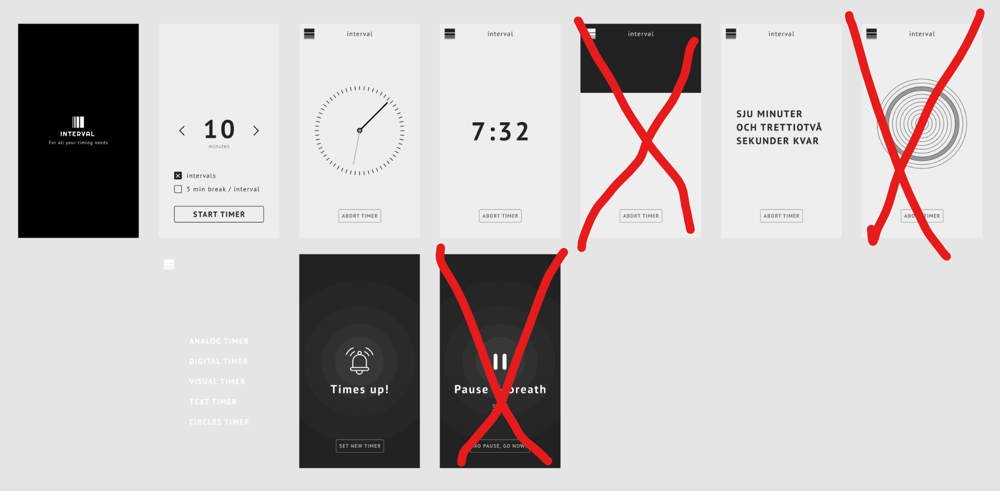

# Interval App - for all your timing needs

## Uppgiftspresentation
https://folkuniversitetet-se.zoom.us/rec/share/w8FBDlINKNcrC3kKcWSdkPJ98AjQDs5XvWaYSuvVRjZcQT1gg-uCinCQosfQMTfG.I3rsQfbYFdyWw0LO?startTime=1728994980000
Lösenkod: E406gsG?

## Bakgrund
Förmågan att mäta tid är väldigt användbart. Från träning till studier är en bra timer guld värd.

Några användningsområden för en bra tidtagar-app är:

- [Timeboxing](https://medium.com/dreimannzelt-adventures/7-secrets-to-master-timeboxing-66a744ea9175)
- [Pomondoro metoden](https://www.metodbanken.se/post/pomodorometoden)
- [Parprogrammering](https://sv.wikipedia.org/wiki/Parprogrammering)

## Uppdragsbeskrivning
Ert uppdrag är att skapa en ultimata tidtagar-webbappen för mobiler. Den är enkel till sin funktion, men kan visa tid på flera olika sätt, se vybeskrivningar samt screens nedan.

Viss remix av utseende får göras, ex. lägga till färger, ändra fonter etc, dock skall funktionalitet och övergripande layout vara densamma

## Funktionella krav

|Vy|Beskrivning|
|---|---|
|loading|en loading screen där endast logotyp samt slogan finns med. Du kommer vidare till *Set Timer* genom att klicka på logotypen.|
|set timer|Här ställer du in hur många minuter timern skall gå. **OBS! VG krav** Du anger också om timern ska gå i intervaller, d.v.s. starta om efter den nått 0. Valet att även lägga in en 5 minuters pause mellan varje intervall finns. Detta är väldigt användbart i ex. studiesyfte med [pomondoro metoden](https://www.metodbanken.se/post/pomodorometoden) alt. när man [parprogrammerar](https://sv.wikipedia.org/wiki/Parprogrammering). |
|analog timer|Här visas tiden med en analog urtavla där minut samt sekundvisaren rör sig. En knapp för att avbryta nuvarande timer och återgå till *set timer* skall finnas.|
|digital timer|Här visas tiden med en digital klocka som uppdateras varje sekund. En knapp för att avbryta nuvarande timer och återgå till *set timer* skall finnas.|
|alarmvy|Denna vy visas när tiden är ute. En knapp för att gå till *set timer* skall finnas.|
|text timer **VG**|Visa tiden med hjälp av skriven text.|

På samtliga timervyer skall ha en *meny-ikon* i hörnet visa en meny där användaren ska kunna växla mellan olika timer-vyer. Notera att dessa byten inte skall avbryta eller nollställa timern.

En interaktiv mockup hittar ni [här](https://www.figma.com/proto/AerBB2Yx3IiT9iL8U8akVR/Interval-app-1.0?node-id=23%3A176&scaling=scale-down&page-id=23%3A3).

Figma-filen hittar du [här](https://www.figma.com/file/AerBB2Yx3IiT9iL8U8akVR/Interval-app-1.0).

## Tekniska krav
* Att jobba med tid i programmering kan snabbt bli väldigt komplext. Därför är det högst rekomenderat att använda ett bibliotek som underlättar just detta. Ex. [EasyTimer.js av Albert Gonzalez](https://albert-gonzalez.github.io/easytimer.js/).
* Gjord i antingen React med framer motion ELLER html, css och vanilla JS med anime.js.
* Använder sig av någon CSS animering (transitions eller keyframes) varsomhelst.

## Betygskriterier

**För Godkänt:**
* Uppfyller alla funktionella och tekniska krav.
* Appen ser ut som på Figmaskissen (behöver inte vara pixel-perfect men den skall se bra ut!). 

**För Väl Godkänt:**
* Har implementerat vyn för "text timer".
* Har implementerat funktionaliteten för intervaller.

## Inlämning

Inlämning sker på Azomo med en länk till ditt Github repo med din kod senast 23/10 23:59.

## Muntlig redovisning

Denna kurs har en obligatorisk privat muntlig redovisning/frågestund som kan bokas in under torsdagen och fredagen den 24-25 oktober. Varje studerande kommer få 10 minuter på sig att dels genomföra en snabb demonstration, samt svara på frågor om sin uppgift för att kunna nå godkänt betyg, för VG-nivå kan svårare frågor förekomma. Även frågor om hur dina animationer förhåller sig till någon av animationens 12 grundprinciper kan förekomma. Redovisningen och frågestunden kan om ni så önskar hållas på engelska för att träna inför nästa kurs. Isåfall behöver ni meddela mig detta i kommentaren när ni laddar upp uppgiften.

Bokar man inte in sig på en tid, dyker man inte upp, och kan man inte svara på frågorna så är man inte godkänd.

Tidsbokningen publiceras här under nästkommande vecka. Jag meddelar på Discord när den finns tillgänglig.
